M. Amintoosi, m.amintoosi at gmail.com

کد مربوط به مقاله ارسالی با عنوان:

## تمام متصل به تمام پیچشی: پلی به گذشته
 

### چکیده
در یک دهه‌ی گذشته شبکه‌های پیچشی متعددی برای قطعه‌بندی معنایی تصاویر ابداع شده‌اند که عملکرد بسیار خوبی در تشخیص و برچسب‌زنی اشیاء از خود نشان داده‌اند. عمده‌ی این شبکه‌ها متضمن معماری‌های با اندازه‌ی بزرگ هستند که توانایی آشکارسازی ده‌ها یا صدها دسته‌ی از قبل مشخص را داشته باشند. در بیشتر کاربردها از معماری‌هایی استفاده می‌شود که پس از چند لایه‌ی پیچشی از یک طبقه‌بند معمول برای طبقه‌بندی ویژگی‌های استخراج شده‌ی شبکه استفاده می‌شود.  در این نوشتار روش تبدیل یک شبکه آموزش دیده‌ی اینچنینی به یک شبکه تمام پیچشی بیان شده است. مزیت اصلی این شیوه، قابلیت کارکرد بر روی ورودی‌های با اندازه متغیر و تولید یک نقشه خروجی به جای یک عدد می‌باشد که همان مزیت شبکه‌های تمام پیچشی است. در مدل‌های جدید حوزه یادگیری عمیق عموماً از تصاویر آموزشی که در آنها نواحی موردنظر با ماسک مشخص شده‌اند استفاده می‌شود، اما در شیوه‌ی پیشنهادی در این نوشتار فقط تصاویر برچسب‌دار (مشخص‌کننده طبقه‌ی تصویر) به شبکه داده می‌شود.
جزییات روش کار در قالب مسئله‌ی جدید طبقه‌بندی  و شناسایی تابلوهای با رسم‌الخطهای شکسته نستعلیق و ثلث، شناسایی برگ سالم از مریض سیب (به عنوان مسائل دو کلاسه) و مسئله‌ی شناسایی ارقام فارسی بیان شده است.
به این منظور ابتدا یک شبکه پیچشی با لایه آخر تمام متصل طراحی و بر روی تصاویر مربعی آموزش داده می‌شود. سپس مدل تمام پیچشی جدیدی بر اساس مدل قبلی تعریف شده و وزنهای مدل قبلی به مدل جدید خورانده می‌شود. تنها تفاوت دو مدل در لایه آخر است، اما مدل جدید قابلیت کار بر روی تصاویر ورودی با هر اندازه را خواهد داشت.
نتایج آزمایشات کارایی این شیوه را نشان داده است 

یک شبکه‌ی پیچشی با لایه‌ی آخر تمام متصل:

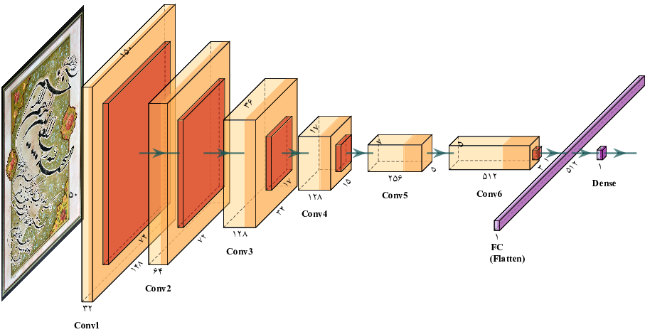

تبدیل مدل بالا به یک مدل تمام پیچشی: 

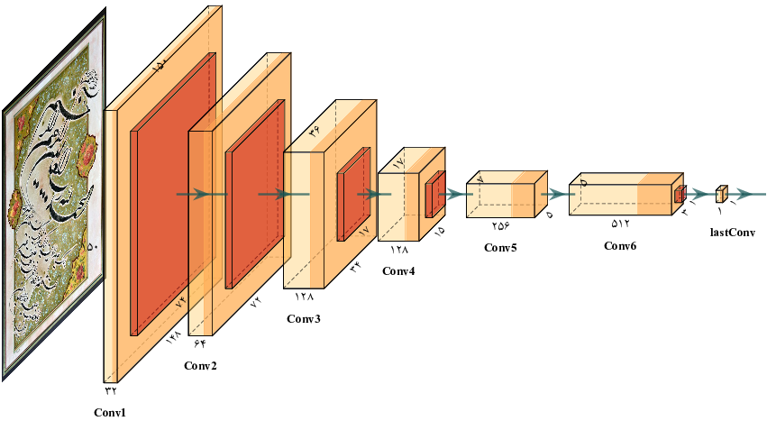

مدل فوق قابلیت کار بر روی ورودی‌های با اندازه‌ی متغیر را داراست:

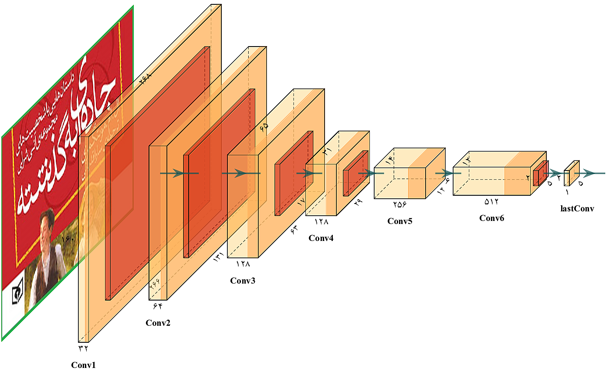

برای هر یک از مجموعه دادگان مورد استفاده در مقاله یک فایل ژوپیترنوت بوک آماده شده است که قابل اجرا بر روی گوگل کولب است.
همه عملیات روی سرورهای گوگل انجام می‌شود.

### مجموعه دادگان تابلونگار‌ه‌های رسم‌الخطهای شکسته نستعلیق و ثلث
از لینک زیر می‌توانید برنامه مربوط به این مجموعه دادگان را اجرا کنید

https://colab.research.google.com/github/mamintoosi/FC2FC/blob/main/FC2FC_Calligraphy.ipynb

برای هر مجموعه داده و برای هر مدل
نمودارهای 
مقدار تابع هزینه برای داده‌های آموزشی و اعتبارسنجی و همچنین ماتریس درهم‌ریختگی حاصل از تست مدل بر روی داده‌های آزمون نمایش داده می‌شود.
<table>
<tr> 
<td>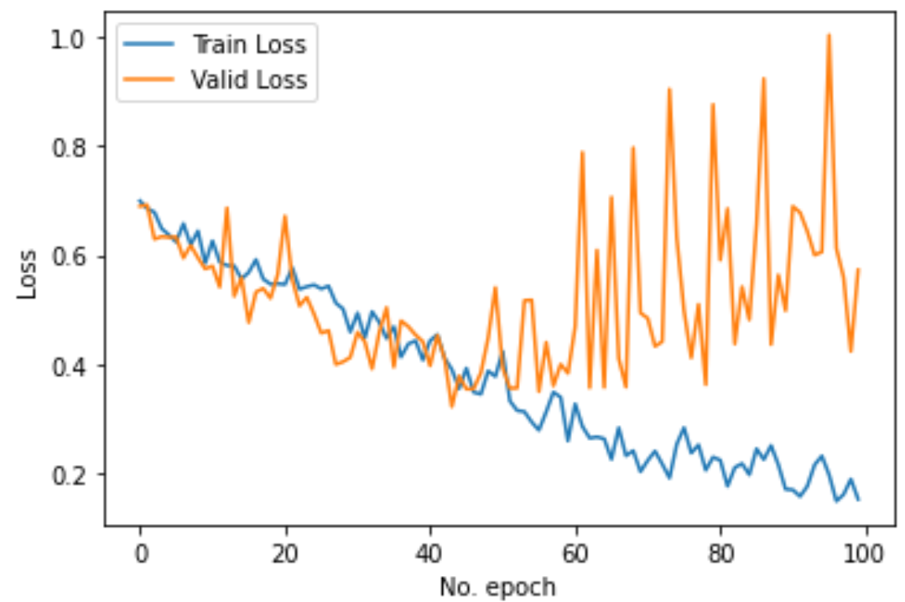 </td>
<td>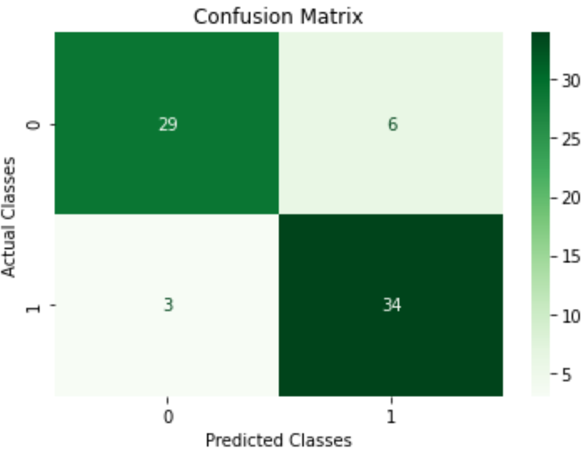 </td>
</tr>
</table>
خروجی‌های مربوط به این مجموعه دادگان (توضیح در متن مقاله)
<table>
<tr> 
<td>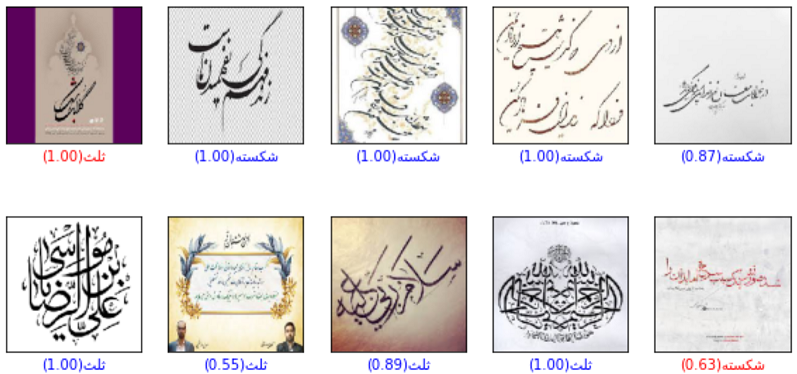 </td>
<td>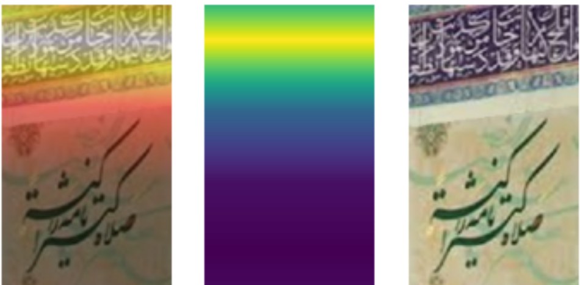 </td>
</tr>
</table>

### مجموعه دادگان شناسایی برگ‌های سالم و بیمار درخت سیب
از لینک زیر می‌توانید برنامه مربوط به این مجموعه دادگان را اجرا کنید

https://colab.research.google.com/github/mamintoosi/FC2FC/blob/main/FC2FC_PlantDisease.ipynb

برای هر مجموعه داده و برای هر مدل
نمودارهای 
مقدار تابع هزینه برای داده‌های آموزشی و اعتبارسنجی و همچنین ماتریس درهم‌ریختگی حاصل از تست مدل بر روی داده‌های آزمون نمایش داده می‌شود.
<table>
<tr> 
<td>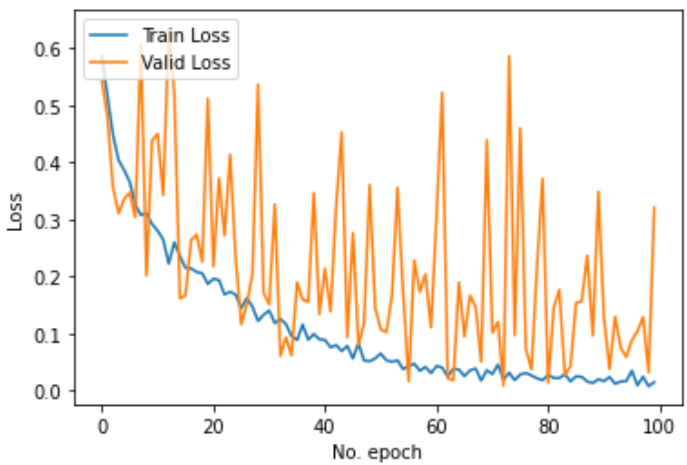 </td>
<td>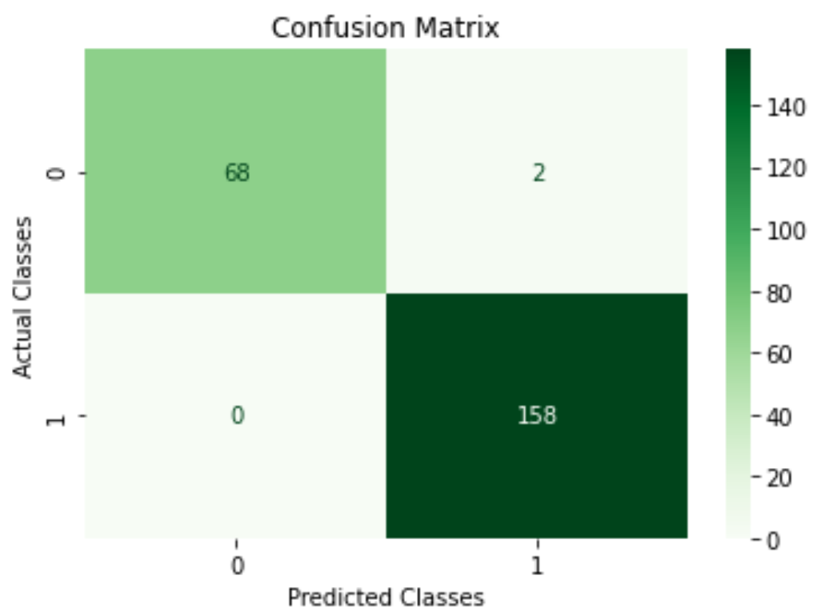 </td>
</tr>
</table>
خروجی‌های مربوط به این مجموعه دادگان (توضیح در متن مقاله)
<table>
<tr> 
<td>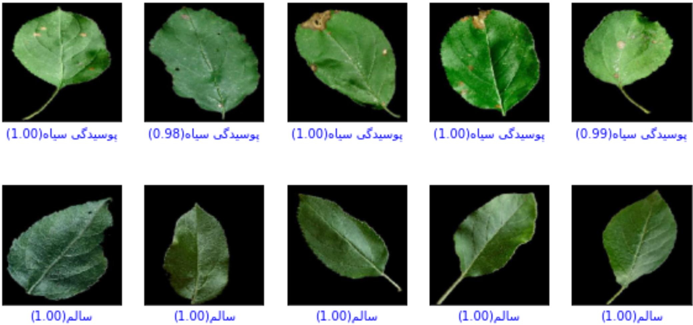 </td>
<td>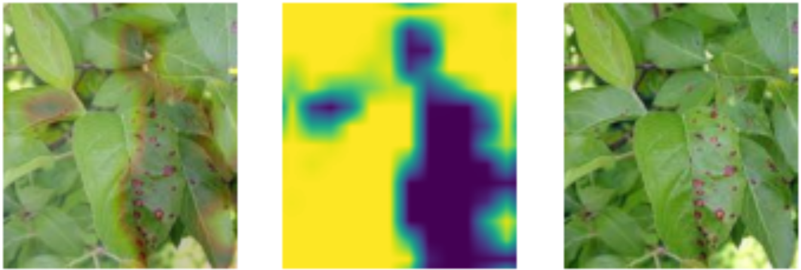 </td>
</tr>
</table>

### مجموعه دادگان ارقام دست‌نویس فارسی
از لینک زیر می‌توانید برنامه مربوط به این مجموعه دادگان را اجرا کنید

https://colab.research.google.com/github/mamintoosi/FC2FC/blob/main/FC2FC_Hoda.ipynb
