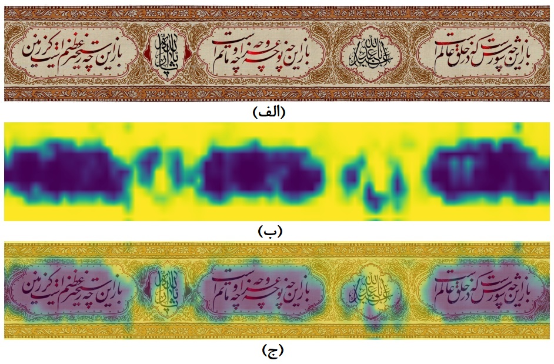
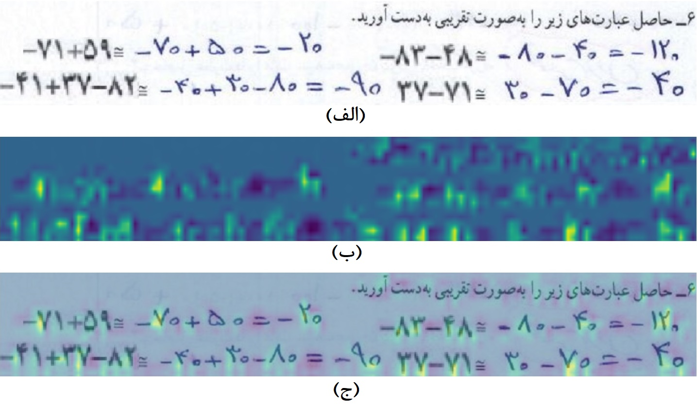

M. Amintoosi, m.amintoosi at gmail.com

[](https://github.com/mamintoosi/FC2FC/archive/master.zip)
 [](https://github.com/mamintoosi/FC2FC/network)
[](https://github.com/mamintoosi/FC2FC/issues)
[](https://github.com/mamintoosi/FC2FC/blob/main/LICENSE)

<div dir="rtl">

## تمام متصل به تمام پیچشی: پلی به گذشته

###  برخی از تصاویر و کدهای مرتبط با مقاله پذیرفته شده‌ی زیر:
</div>

```
@article{Amintoosi1401_FC2FC,
    author = {محمود امین‌طوسی},
    title = {تمام متصل به تمام پیچشی: پلی به گذشته},
    journal = {نشریه رایانش نرم و فناوری اطلاعات },
    year = {1401},
    note = {پذیرفته شده، آماده انتشار}}
```

<div dir="rtl">


### چکیده
در یک دهه‌ی گذشته شبکه‌های پیچشی متعددی برای قطعه‌بندی معنایی تصاویر ابداع شده‌اند که عملکرد بسیار خوبی در تشخیص و برچسب‌زنی اشیاء از خود نشان داده‌اند. عمده‌ی این شبکه‌ها متضمن معماری‌های با اندازه‌ی بزرگ هستند که توانایی آشکارسازی ده‌ها یا صدها دسته‌ی از قبل مشخص را داشته باشند. در بیشتر کاربردها از معماری‌هایی استفاده می‌شود که پس از چند لایه‌ی پیچشی از یک طبقه‌بند معمول برای طبقه‌بندی ویژگی‌های استخراج شده‌ی شبکه استفاده می‌شود.  در این نوشتار روش تبدیل یک شبکه که به عنوان طبقه‌بند، دو لایه‌ی مسطح و چگال (تمام متصل) دارد، به ‌یک شبکه تمام پیچشی بیان شده است. مزیت اصلی این شیوه، قابلیت کارکرد بر روی ورودی‌های با اندازه متغیر و تولید یک نقشه خروجی به جای یک عدد می‌باشد که همان مزیت شبکه‌های تمام پیچشی است. در مدل‌های جدید حوزه‌‌ی یادگیری عمیق عموماً از تصاویر آموزشی که در آنها نواحی موردنظر با ماسک مشخص شده‌اند استفاده می‌شود، اما در شیوه‌ی پیشنهادی در این نوشتار فقط تصاویر برچسب‌دار (مشخص‌کننده طبقه‌ی کل تصویر) به شبکه داده می‌شود. جزییات روش کار در قالب مسئله‌ی جدید طبقه‌بندی  و شناسایی تابلوهای با رسم‌الخطهای شکسته نستعلیق و ثلث، شناسایی برگ سالم از مریض سیب (به عنوان مسائل دو کلاسه) و مسئله‌ی شناسایی ارقام فارسی بیان شده است. به این منظور ابتدا یک شبکه پیچشی با لایه آخر تمام متصل طراحی و بر روی تصاویر مربعی آموزش داده می‌شود. سپس مدل تمام پیچشی جدیدی بر اساس مدل قبلی تعریف شده و وزنهای مدل قبلی به مدل جدید کپی می‌شود. تنها تفاوت دو مدل در لایه آخر است، اما مدل جدید قابلیت کار بر روی تصاویر ورودی با هر اندازه را خواهد داشت. نتایج آزمایشات کارایی این شیوه را نشان داده است

<a href="https://github.com/mamintoosi/FC2FC/raw/main/Manuscript_01.pdf">
 نسخه‌ی اول (با زی‌پرشین)
 </a>
-
<a href="https://github.com/mamintoosi/FC2FC/raw/main/Manuscript_04_final.pdf">
 نسخه‌ی نهایی (با ورد)
 </a>
 -
 <a href="http://www.jscit.nit.ac.ir/article_149453.html">
 لینک به مجله
 </a>

در ادامه برخی از تصاویر مقاله و کدهای مرتبط با آزمایشات مقاله ذکر شده است. همه‌ی برنامه‌ها **منبع باز** بوده و *لینک اجرا روی کولب* درج شده است که بدون نیاز به دانلود یا نصب، بتوان برنامه‌ها را در مرورگر اجرا نمود.

یک شبکه‌ی پیچشی با لایه‌ی آخر تمام متصل:


تبدیل مدل بالا به یک مدل تمام پیچشی: 


مدل فوق قابلیت کار بر روی ورودی‌های با اندازه‌ی متغیر را داراست:


برای هر یک از مجموعه دادگان مورد استفاده در مقاله یک فایل ژوپیترنوت بوک آماده شده است که قابل اجرا بر روی گوگل کولب است.
همه عملیات روی سرورهای گوگل انجام می‌شود.

### مجموعه دادگان تابلونگار‌ه‌های رسم‌الخطهای شکسته نستعلیق و ثلث
از لینک زیر می‌توانید برنامه مربوط به این مجموعه دادگان را اجرا کنید
</div>
https://colab.research.google.com/github/mamintoosi/FC2FC/blob/main/FC2FC_Calligraphy.ipynb
<div dir="rtl">
برای هر مجموعه داده و برای هر مدل
نمودارهای 
مقدار تابع هزینه برای داده‌های آموزشی و اعتبارسنجی و همچنین ماتریس درهم‌ریختگی حاصل از تست مدل بر روی داده‌های آزمون نمایش داده می‌شود.
<table>
<tr> 
<td> </td>
<td> </td>
</tr>
</table>
خروجی‌های مربوط به این مجموعه دادگان (توضیح در متن مقاله)
<table>
<tr> 
<td> </td>
<td> </td>
</tr>
</table>

### مجموعه دادگان شناسایی برگ‌های سالم و بیمار درخت سیب
از لینک زیر می‌توانید برنامه مربوط به این مجموعه دادگان را اجرا کنید
</div>
https://colab.research.google.com/github/mamintoosi/FC2FC/blob/main/FC2FC_PlantDisease.ipynb
<div dir="rtl">
برای هر مجموعه داده و برای هر مدل
نمودارهای 
مقدار تابع هزینه برای داده‌های آموزشی و اعتبارسنجی و همچنین ماتریس درهم‌ریختگی حاصل از تست مدل بر روی داده‌های آزمون نمایش داده می‌شود.
<table>
<tr> 
<td> </td>
<td> </td>
</tr>
</table>
خروجی‌های مربوط به این مجموعه دادگان (توضیح در متن مقاله)
<table>
<tr> 
<td> </td>
<td> </td>
</tr>
</table>

### مجموعه دادگان ارقام دست‌نویس فارسی
از لینک زیر می‌توانید برنامه مربوط به این مجموعه دادگان را اجرا کنید
</div>
https://colab.research.google.com/github/mamintoosi/FC2FC/blob/main/FC2FC_Hoda.ipynb

خروجی‌ مربوط به این مجموعه دادگان (توضیح در متن مقاله)
<div align=center>

</div>

##### برنامه مرتبط با بررسی تغییر تعداد پارامترها

برای بررسی عملی تاثیر تغییر اندازه ورودی بر تعداد پارامترهای مدل‌های پیچشی-چگال و تمام پیچشی، برنامه 
زیر را اجرا کنید. در این برنامه، علاوه بر مشاهده جدولهای ۱ و ۲ مقاله، تعداد پارامترهای مربوطه وقتی اندازه ورودی دو برابر می‌شود را نشان می‌دهد. 

</div>
https://colab.research.google.com/github/mamintoosi/FC2FC/blob/main/Check_FC2FC_Params.ipynb

<div dir="rtl">
عنوان مقاله مقتبس از نام کتاب 
<a href="https://www.digikala.com/product/dkp-1155579/%DA%A9%D8%AA%D8%A7%D8%A8-%D8%AC%D8%A7%D8%AF%D9%87-%D8%A7%DB%8C-%D8%A8%D9%87-%DA%AF%D8%B0%D8%B4%D8%AA%D9%87-%D8%A7%D8%AB%D8%B1-%D8%A7%D9%84%D8%A7%D9%85%D9%85%D9%88%D9%86%D8%AA%DA%AF%D9%88%D9%85%D8%B1%DB%8C-%D8%A7%D9%86%D8%AA%D8%B4%D8%A7%D8%B1%D8%A7%D8%AA-%D9%82%D8%AF%DB%8C%D8%A7%D9%86%DB%8C/">
«جاده‌ای به گذشته» 
</a>
اثر ال.ام.مونتگومری (مؤلف مجموعه داستان‌های آن شرلی) بوده است.
</div>
<a href="https://lmmonline.org/the-road-to-yesterday/">
The Road to Yesterday (L.M. Montgomery Books)
</a>
<a href="https://www.fadedpage.com/showbook.php?pid=20170477">, Free Text </a>